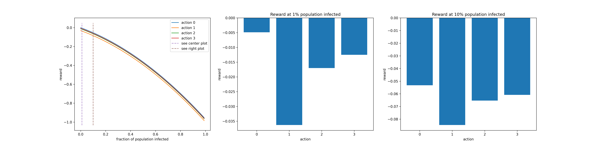
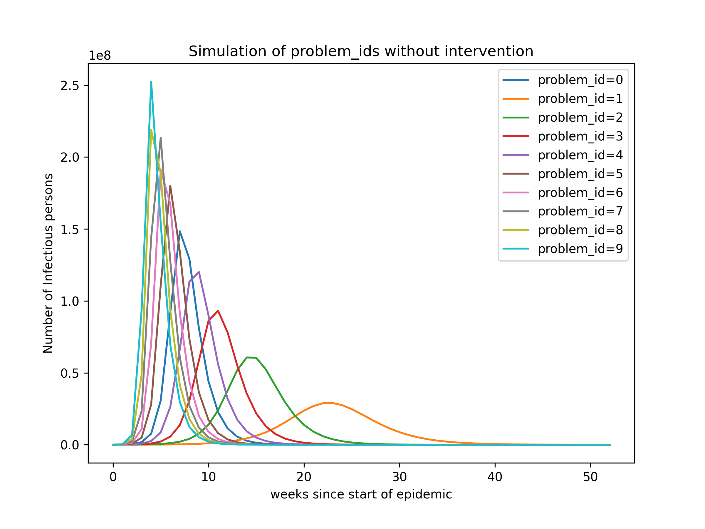
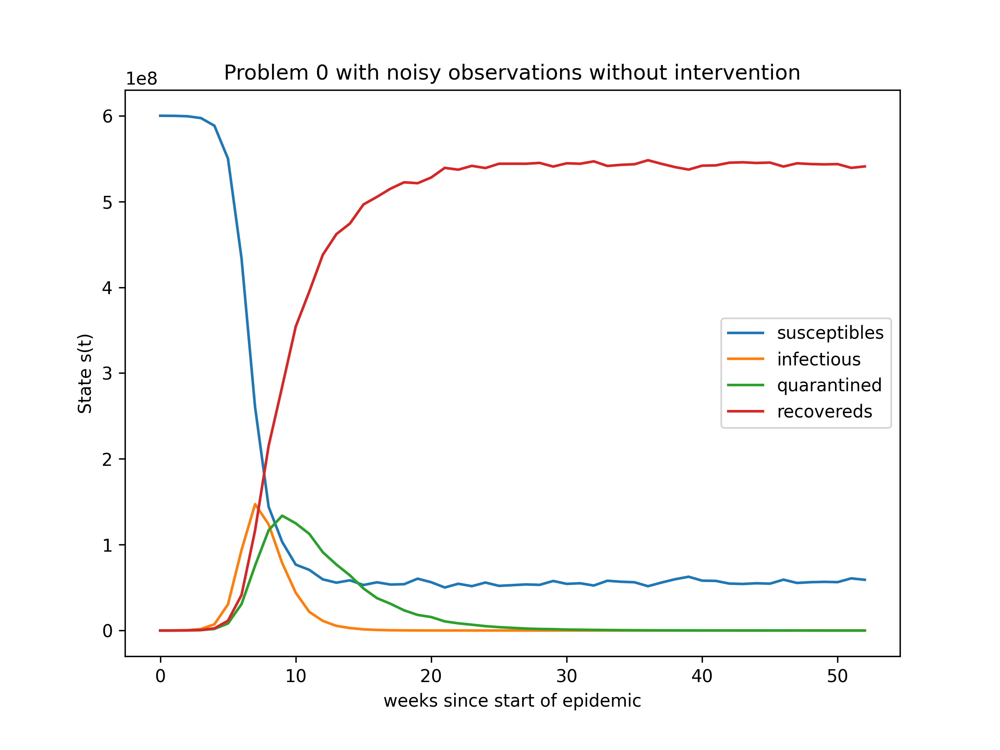
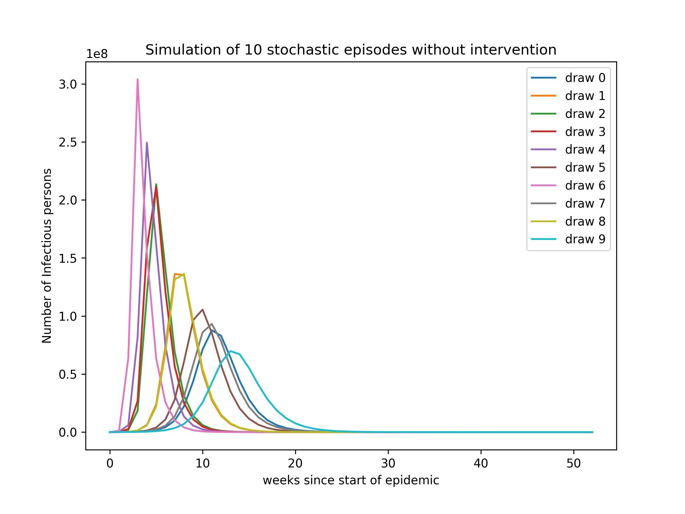

# ViRL

ViRL is an Epidemics Reinforcement Learning Environment. Agents are tasked with controlling the spread of a virus with one of four non-medical policy interventions: 

0. no intervention (remove all restrictions)
1. impose a full lockdown
2. implement track & trace
3. enforce social distancing and face masks


Once per week, the agent obtains evidence of the state of the epidemic and can update its policy accordingly. Each episode ends after 52 weeks, irrespective of the remaining number of infected individuals at that time.

Each intervention has a different impact on the infection rate, on the total number of simultaneously infected and hospitalized persons, and on the economic opportunity cost, which are summarized as a single scalar reward at each time step.  The reward as a function of the infected population, and as a function of the action taken (at fixed level of infection) is illustrated in the figure below.



## Getting Started

Ensure you have Python 3.5 or above, gym, numpy and matplotlib installed.

The Epidemic implements the OpenAI gym.Environment and is instantiated with default parameters as shown in the code snippet below.

```
import virl
env = virl.Epidemic()
```

### Problem ID

The Epidemic environment implements 10 deterministic epidemic problems, each with a different set of parameters. The specific problem simulated by an instance of Epidemic is specified in the constructor's `problem_id` parameter. The figure below illustrates how the number of infected persons varies across problems if no intervention (`action=0`) is performed.

```
env = virl.Epidemic(problem_id=2) # problem_id should be in [0, 9] and is set to 0 by default.
```



### Observation Noise

Independent observation noise on each timestep can be activated by setting the `noisy` flag in the constructor. The figure below illustrates one sequence of noisy observations, where no intervention (`action=0`) is performed.

```
env = virl.Epidemic(noisy=True) # False by default.
```



### Stochasticity

A stochastic environment with different epidemic dynamics in each episode can be activated by setting the `stochastic` flag in the constructor. If `stochastic` is set to true, then `problem_id` is ignored. The figure below illustrates how the number of infected persons varies across random draws if no intervention (`action=0`) is performed.

```
env = virl.Epidemic(stochastic=True) # False by default.
```



### Example Agent

[notebooks/random_agent.ipynb](notebooks/random_agent.ipynb) illustrates a basic (random) agent interacting with the environment.

## Disclaimer

ViRL is a toy environment for educational purposes on Reinforcement Learning algorithms. ViRL does not aim to replicate any epidemic in particular. The net effect of policy interventions is not grounded in reality and the net reward is entirely fictional. As a result, optimal policies on this toy example do not generalize to real-world epidemics.


## Author Contact

If you have any questions or feedback, please contact the author
[Sebastian Stein](mailto:sebastian.stein@glasgow.ac.uk)